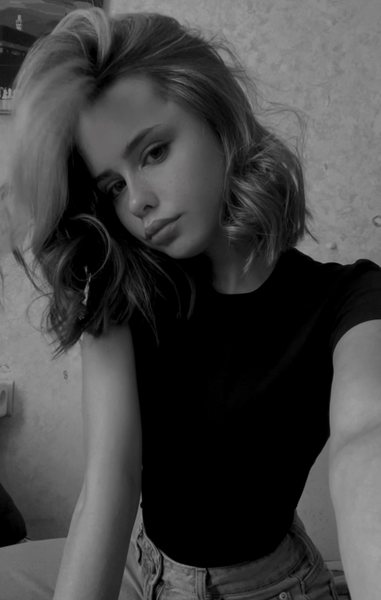

<!DOCTYPE html>
<html lang="ru">
<head>
    <meta charset="UTF-8">
    <meta name="viewport" content="width=device-width, initial-scale=1.0">
    <title>Портфолио - Екатерина Бурхович</title>
    
</head>
<body>

    <header>
        <h1>Екатерина Бурхович</h1>
        
Веб-разработчик | Дизайнер | Создаю красивые сайты

    </header>

    

        
    

    <section>
        <h2>Обо мне</h2>
        
Привет! Меня зовут Катя. Я создаю современные сайты, которые работают быстро и красиво выглядят на любых устройствах.

        
Люблю учиться новому и решать сложные задачи.

    </section>

    <section>
        <h2>Мои работы</h2>
        

            

                <h3>Сайт для кофейни</h3>
                
Красивый сайт с меню, картой и онлайн-заказом.

                <a href="#">Смотреть →</a>
            

            

                <h3>Лендинг фитнес-клуба</h3>
                
Продающий сайт с формой записи на тренировку.

                <a href="#">Смотреть →</a>
            

            

                <h3>Блог путешественника</h3>
                
Сайт со статьями, фотографиями и картой маршрутов.

                <a href="#">Смотреть →</a>
            

        

    </section>

    <section>
        <h2>Свяжитесь со мной</h2>
        
📧 Email: <a href="mailto:kataburhovich251@gmail.com">kataburhovich251@gmail.com</a>

        
📱 Telegram: <a href="https://t.me/vidast1" target="_blank">@vidast1</a>

    </section>

    <footer>
        
© 2026 Екатерина Бурхович. Сделано с ❤️

    </footer>

</body>
</html>
